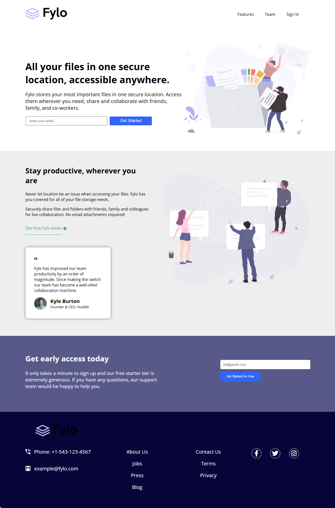

# Frontend Mentor - Fylo landing page with two column layout

This is a solution to the [Fylo landing page with two column layout
](https://www.frontendmentor.io/challenges/fylo-landing-page-with-two-column-layout-5ca5ef041e82137ec91a50f5). Frontend Mentor challenges help you improve your coding skills by building realistic projects.

## Table of contents

- [Overview](#overview)
  - [The challenge](#the-challenge)
  - [Screenshot](#screenshot)
  - [Links](#links)
- [My process](#my-process)
  - [Built with](#built-with)
  - [What I learned](#what-i-learned)
  - [Continued development](#continued-development)
- [Author](#author)
- [Acknowledgments](#Acknowledgments)

## Overview

### The challenge

This project is great if you're starting to get confident with slightly more complex layouts. The second section with the testimonial area will provide a nice challenge.

Your users should be able to:

- View the optimal layout for the interface depending on their device's screen size
- See hover and focus states for all interactive elements on the page

### Screenshot

### Links

- Solution URL: [here](https://github.com/olahasan/HTML_AND_CSS_Frontend-Mentor_JUNIOR-Fylo-landing-page-with-two-column-layout)

- Live Site URL: [here](https://olahasan.github.io/HTML_AND_CSS_Frontend-Mentor_JUNIOR-Fylo-landing-page-with-two-column-layout/)

## My process

### Built with

- Semantic HTML5 markup
- CSS custom properties
- Flexbox
- CSS Grid
- Mobile-first workflow

### What I Learned

In this project, I learned how to effectively use CSS Grid and Flexbox to create a responsive layout. I also practiced using CSS custom properties for maintaining a consistent color scheme and improved my understanding of responsive design with media queries.

### Continued Development

In future projects, I plan to focus on improving accessibility by using more semantic HTML tags and adding ARIA labels where necessary. I also aim to further optimize my CSS by grouping similar styles together.

### Author

Frontend Mentor - @olahasan 
GitHub - @olahasan

### Acknowledgments

Thanks to **Frontend Mentor** for providing this challenge and to the community for their support and feedback
